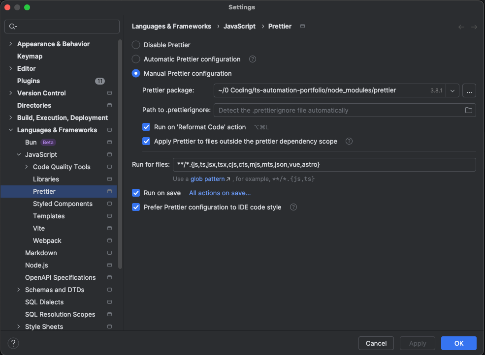

# Prettier

## What it does

Prettier is an **opinionated code formatter**. It rewrites files into a consistent style (indentation, quotes, line
wraps, trailing commas, etc.) so the team doesn’t waste time debating formatting.

It does **not** replace ESLint rules about code quality (bugs, best practices). It focuses on **formatting only**.

---

## Configuration Files

- **`.prettierrc`**
  The main Prettier configuration (formatting rules).

- **`.prettierignore`**
  Paths/files to exclude from formatting (similar to `.gitignore`).

- **`.editorconfig`** (optional support)
  Editor-level defaults (e.g., indentation, line endings). Prettier can respect some EditorConfig settings, but
  `.prettierrc` remains the source of truth for Prettier rules.

---

## How to run locally

### Detect problematic files

Run script

```
npm run format:check
```

It will output the list of files which have problems

---

### FIX all problematic files

Warning! This will modify your files based on the prettier rules.
Run script

```
npm run format
```

---

### FIX Selected code only

First, you need to install the prettier plugin in your IDE of choice.
The below instructions are for Webstorm on Mac.

Step 1

Preferences → Plugins
Make sure Prettier plugin is enabled.

Step 2

Settings → Languages & Frameworks → JavaScript → Prettier

Set:

✔ On code reformat

✔ On save

as on this screenshot



Prettier package → should auto-detect local version

Now when you press:

⌥ + ⌘ + L

It uses Prettier rules from .prettierrc.
